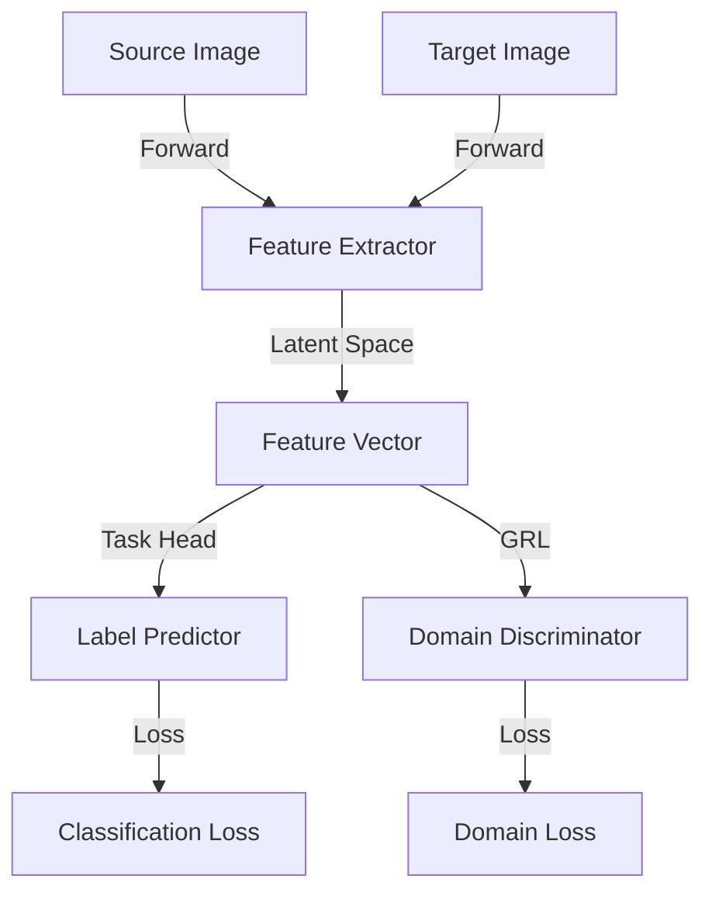

# Data Model: Unsupervised Domain Adaptation (DANN)

This document describes the entities, data structures, and relationships for the Domain-Adversarial Neural Network implementation.

## Core Entities

### 1. Source Image (Labeled)
- **ID**: Unique identifier for the source image.
- **Path**: Absolute or relative path to the image file.
- **Label**: Integer ID corresponding to the plant species.
- **Domain**: Constant value `0` (Source).

### 2. Target Image (Unlabeled)
- **ID**: Unique identifier for the target image (quadrat).
- **Path**: Absolute or relative path to the image file.
- **Label**: `None` (Unlabeled).
- **Domain**: Constant value `1` (Target).

### 3. Model Components (Latent Entities)
- **Feature Vector**: A high-dimensional representation ($d=768$ for ViT-B/14) produced by the shared Feature Extractor.
- **Class Logits**: Probability distribution over $N$ plant species.
- **Domain Logits**: Binary classification output ($p_{target}$) from the Domain Discriminator.

## Relationships & Data Flow

## Validation Rules

- **Input Dimensions**: All images MUST be resized to $224 \times 224$ (standard for ViT) or $448 \times 448$ (as specified in configuration).
- **Batch Consistency**: Every training batch MUST contain an equal number of samples from both the Source and Target domains.
- **Label Encoding**: Species labels must be consistent across all source domain datasets.

## Training State Transitions

1. **Pre-training**: Feature extractor initialized with DINOv2 weights.
2. **Warm-up**: Training only the Label Predictor and Domain Discriminator while keeping the Feature Extractor frozen for 1-2 epochs.
3. **Adversarial Training**: Simultaneous training of all components with active Gradient Reversal.
4. **Convergence**: Domain discriminator accuracy approaches 50%, while classification accuracy on source data stabilizes.
